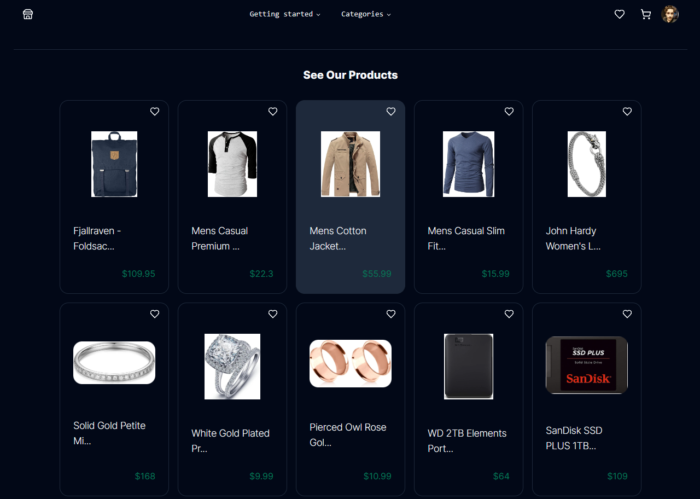
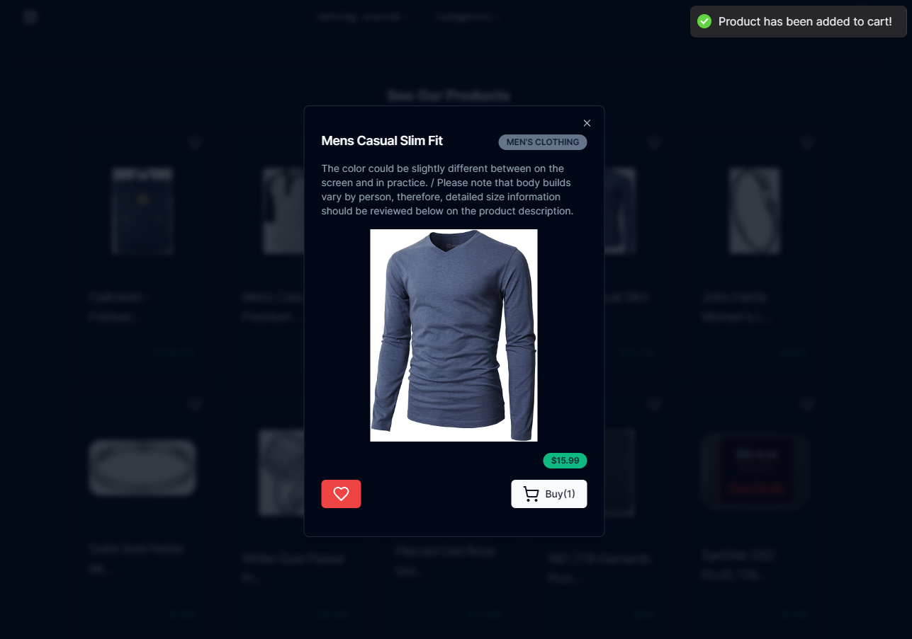

## 💻 About

A simple e-commerce page with some functions like list and open products, add or remove to cart.

<h1 align="center">
  
</h1>

<br>

## 🧪 Tools Used

This project was built with the following tools 

- [Next.js](https://nextjs.org/)
- [React.js](https://reactjs.org)
- [TypeScript](https://www.typescriptlang.org/)
- [Radix-UI](https://www.radix-ui.com/)
- [Shadcn/UI](https://ui.shadcn.com/)
- [Tailwind CSS](https://tailwindcss.com/)

## 🔗 Clone the App

How to clone:

```bash
$ git clone https://github.com/brunofilho1/ecommerce-experience
$ cd ecommerce-experience
```

## 🚀 how to start the App

To start:

```bash
# Instalando dependências:
pnpm i

# Rodando em modo de desenvolvimento:
pnpm dev
```

<h1 align="center">
    
</h1>

<h1 align="center">
    
</h1>

## 🌐 Live preview

<a src="https://ecommerce-experience.vercel.app/" target="_blank">https://ecommerce-experience.vercel.app/</a>
